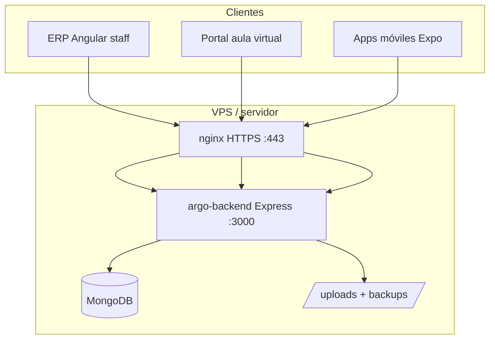

# ARGO — Características técnicas del stack y seguridad (ISO/IEC 27001)

Documento de referencia para **propuestas comerciales**, **fichas técnicas** y **auditorías internas**.  
Producto: **ARGO** — ERP vertical para CEAs y centros de formación vial (Colombia).  
Actualizado: **junio 2026**.

> **Nota:** ARGO implementa controles alineados con buenas prácticas de **ISO/IEC 27001:2022** (Anexo A).  
> Este documento **no sustituye** una certificación ISO oficial; describe lo que el software y el despliegue recomendado cubren.

---

## 1. Identificación del producto

| Campo | Valor |
|-------|--------|
| **Nombre** | ARGO |
| **Tipo** | ERP / plataforma de gestión operativa y aula virtual |
| **Mercado** | CEAs, centros de capacitación vial, formación empresarial (Colombia) |
| **Moneda / locale** | COP · `es-CO` |
| **Modelo de despliegue** | On-premise / VPS dedicado por cliente (Docker Compose) |
| **Estado** | Producción operativa · desarrollo activo |
| **Repositorio** | Monorepo multi-aplicación |

---

## 2. Stack tecnológico

### 2.1 Resumen por capa

| Capa | Tecnología | Versión / notas |
|------|------------|-----------------|
| **Runtime backend** | Node.js | 20+ |
| **Framework API** | Express | 4.x |
| **ODM / base de datos** | Mongoose + MongoDB | Mongoose 8 · MongoDB 6 (Docker prod) |
| **Autenticación** | JWT (`Bearer`) + bcrypt | Tokens configurables (`JWT_EXPIRES`) |
| **Frontend ERP (staff)** | Angular | 19 (standalone components, signals) |
| **Portal alumnos** | Angular | 19 (`argo-aula-virtual`) |
| **Sitio marketing** | HTML estático + nginx | `argo-sitio` (opcional) |
| **Apps móviles** | React Native + Expo | Cajero y aula (`argo-mobile-cajero`, `argo-mobile-aula`) |
| **Gestor de paquetes** | pnpm | Backend, frontends y móvil |
| **Contenedores** | Docker Compose | Producción en VPS |
| **Proxy / TLS** | nginx + Let's Encrypt | Certbot |
| **Tiempo real** | Socket.IO | Foro / notificaciones portal |
| **Archivos** | multer, sharp | Uploads, imágenes, OCR |
| **Correo** | nodemailer | Verificación registro portal (opcional) |
| **Pagos en línea** | Wompi (opcional) | Webhooks API |
| **Facturación electrónica** | Factus (sandbox / pendiente prod) | Integración parcial |

### 2.2 Componentes del monorepo

```
ARGO/
├── argo-backend/           # API REST Node.js + Express + MongoDB
├── argo-frontend/          # ERP web staff (Angular 19) — puerto 4200 dev / 8083 prod
├── argo-aula-virtual/      # Portal público alumnos (Angular 19) — 4202 / 8085
├── argo-sitio/             # Landing marketing (opcional) — 8084
├── argo-mobile-cajero/     # App Android cajero (Expo / React Native)
├── argo-mobile-aula/       # App Android portal alumnos (Expo)
└── deploy/                 # Docker, nginx, guías de seguridad y despliegue
```

### 2.3 Arquitectura lógica



**Principios de diseño:**

- API **REST** bajo prefijo `/api`
- Reglas de negocio en capa **services** (backend)
- **RBAC** configurable: permisos en BD (`RolApp`) + catálogo en código
- **Multi-sede**: filtro por sede y permisos `sedes.*`
- Frontend resuelve URL del API por hostname (LAN y producción con proxy)

### 2.4 Puertos (referencia)

| Entorno | Servicio | Puerto |
|---------|----------|--------|
| Desarrollo | API backend | 3000 |
| Desarrollo | ERP staff | 4200 |
| Desarrollo | Portal alumnos | 4202 |
| Producción Docker | API (host) | 5002 → contenedor 3000 |
| Producción Docker | ERP | 8083 |
| Producción Docker | Portal | 8085 |
| Producción Docker | Sitio | 8084 |
| Producción | Acceso público | **443** (nginx); puertos Docker cerrados al exterior |

### 2.5 Dependencias de seguridad (backend)

| Paquete | Función |
|---------|---------|
| `helmet` | Cabeceras HTTP seguras |
| `express-rate-limit` | Límite de intentos por IP |
| `bcryptjs` | Hash de contraseñas |
| `jsonwebtoken` | Tokens de sesión |
| `otplib` | 2FA TOTP (Authenticator) |
| `cors` | Orígenes permitidos configurables |

---

## 3. Módulos funcionales (alcance del producto)

| Módulo | Descripción |
|--------|-------------|
| Alumnos | Ficha, documentos, OCR cédula, matrículas |
| Programas y servicios | Catálogo académico, tarifas, certificados |
| Caja | Turno, ingresos, egresos, arqueo, cierres, descuadres |
| Certificados | Emisión por tipo, plantillas, QR, alertas vencimiento |
| Programación CEA | Teoría / taller / práctica, calendario |
| Jornadas de capacitación | Contratos empresa, asistencia, certificado automático |
| Vehículos | Flota, documentos, inspección preoperacional |
| Instructores | Hub y portal del instructor |
| RRHH / nómina | Empleados, contratos, períodos, novedades |
| Aula virtual | Cursos HTML, matrículas en línea, foro, blog |
| Configuración | Usuarios, roles, permisos, alarmas, auditoría |
| Sistema | Respaldos, restauración, puesta en cero, migración Excel |
| Facturación electrónica | ⏳ Pendiente integración DIAN completa |

---

## 4. Seguridad — capas implementadas

### 4.1 Autenticación y control de acceso

| Medida | Detalle |
|--------|---------|
| **JWT** | Sesión stateless; secreto único por instalación (`JWT_SECRET`) |
| **RBAC** | Roles y permisos granulares (`admin`, `cajero`, `instructor`, etc.) |
| **2FA TOTP** | Obligatorio en ERP web producción (`MFA_STAFF_REQUIRED=1`) |
| **Códigos de recuperación** | 10 códigos de un solo uso al activar 2FA |
| **Cuenta soporte maestro** | Break-glass del proveedor; credenciales en `.env`, no en BD; 2FA siempre |
| **Reautenticación** | Restaurar respaldo / puesta en cero exigen contraseña + TOTP + frase de confirmación |
| **Portal alumnos** | Login separado; registro público configurable on/off |

### 4.2 Protección perimetral y transporte

| Medida | Detalle |
|--------|---------|
| **HTTPS / TLS** | Let's Encrypt vía nginx + Certbot |
| **TRUST_PROXY** | Backend respeta `X-Forwarded-Proto` detrás de nginx |
| **CORS** | Solo dominios del cliente en `CORS_ORIGIN` |
| **Helmet** | Cabeceras seguras en respuestas API |
| **Cabeceras nginx** | `X-Frame-Options`, `X-Content-Type-Options`, `Referrer-Policy`, etc. |
| **Firewall** | Solo puertos 22, 80, 443 públicos; Docker interno bloqueado |
| **Cloudflare (opcional)** | WAF, anti-DDoS, Turnstile captcha |

### 4.3 Anti-abuso y bots

| Medida | Detalle |
|--------|---------|
| **Rate limiting** | Login staff, login/registro portal, consulta `buscar-alumno` (ventana 15 min) |
| **Cloudflare Turnstile** | Captcha en login/registro ERP y portal (configurable) |
| **Registro portal** | `PORTAL_REGISTRO_ABIERTO=0` cierra registro público |
| **Privacidad buscar-alumno** | No expone celular, dirección ni correo completo |

### 4.4 Auditoría y trazabilidad

| Medida | Detalle |
|--------|---------|
| **Colección `auditoria`** | Acciones sensibles en BD |
| **Logs diarios** | `logs/auditoria/auditoria-AAAA-MM-DD.log` |
| **Logs de auth** | Intentos fallidos en `logs/auth/auth-AAAA-MM-DD.log` |
| **Actividad HTTP** | Monitor de recursos y peticiones |
| **Menú Auditoría** | Consulta desde ERP (Configuración) |

### 4.5 Protección de datos y continuidad

| Medida | Detalle |
|--------|---------|
| **Respaldos completos** | BD (EJSON) + carpeta `uploads/` |
| **Cifrado en reposo** | AES-256-GCM con `BACKUP_CLAVE_CIFRADO` |
| **Integridad** | SHA-256 por archivo (`*.meta.json`) |
| **Copia automática** | Programable (hora y retención en ERP) |
| **Copia previa obligatoria** | Antes de restaurar o puesta en cero |
| **Aislamiento por cliente** | VPS + MongoDB + `.env` + dominios independientes |

### 4.6 Aplicaciones móviles

| Medida | Detalle |
|--------|---------|
| **Exención captcha** | Header `X-ARGO-Cliente: cajero` identifica app oficial |
| **Exención 2FA web** | `MFA_STAFF_WEB_ONLY=1` — 2FA solo en navegador ERP |
| **Almacenamiento seguro** | `expo-secure-store` para tokens en móvil |

---

## 5. Alineación ISO/IEC 27001:2022 (Anexo A)

Mapeo de controles que ARGO y el despliegue recomendado abordan:

| Control ISO 27001:2022 | Implementación en ARGO |
|------------------------|-------------------------|
| **5.15 Control de acceso** | RBAC, JWT, 2FA TOTP staff, cuenta soporte maestro, reautenticación en operaciones críticas |
| **5.29 Seguridad en la información durante la interrupción** | Respaldos cifrados, restauración probada, copias descargables para custodia externa |
| **8.2 Gestión de privilegios de acceso** | Roles configurables, permisos por módulo, multi-sede, admin vs cajero vs instructor |
| **8.10 Eliminación de la información** | Puesta en cero auditada con respaldo previo entregable al cliente |
| **8.12 Prevención de fuga de datos (DLP)** | Descarga de respaldos solo admin auditada; respaldos ilegibles sin clave de cifrado |
| **8.13 Respaldo de la información** | Copia manual, automática diaria, rotación, verificación SHA-256 |
| **8.15 Registro de eventos** | Auditoría BD + logs auth + auditoría de soporte maestro |
| **8.24 Uso de criptografía** | bcrypt (contraseñas), AES-256-GCM (respaldos), TLS (HTTPS), JWT firmado |
| **8.25 Ciclo de vida de desarrollo seguro** | Monorepo versionado, despliegue por `git pull`, secretos fuera del repositorio |

### 5.1 Checklist operativo por instalación (cliente nuevo)

- [ ] `JWT_SECRET` único generado (`openssl rand -hex 32`)
- [ ] `BACKUP_CLAVE_CIFRADO` definida y guardada **fuera del VPS**
- [ ] HTTPS activo en todos los dominios
- [ ] `CORS_ORIGIN` solo dominios del cliente
- [ ] Firewall: solo 22, 80, 443 públicos
- [ ] Turnstile configurado (o documentado por qué no)
- [ ] MFA staff activo (`MFA_STAFF_REQUIRED=1`)
- [ ] Soporte maestro generado (si aplica contrato de soporte)
- [ ] Copia automática programada en Sistema → Copias de seguridad
- [ ] Prueba de login ERP + portal + health API

---

## 6. Variables de entorno críticas (producción)

Archivo: `deploy/.env` (único por cliente; **nunca** en Git)

| Variable | Propósito |
|----------|-----------|
| `JWT_SECRET` | Firma de tokens de sesión |
| `JWT_EXPIRES` | Duración del token (ej. `12h`) |
| `MONGO_URI` | Conexión MongoDB del cliente |
| `CORS_ORIGIN` | Dominios permitidos (ERP + portal) |
| `TRUST_PROXY` | `1` detrás de nginx |
| `BACKUP_CLAVE_CIFRADO` | Cifrado AES-256-GCM de respaldos |
| `MFA_STAFF_REQUIRED` | 2FA obligatorio ERP web |
| `MFA_TOTP_ISSUER` | Nombre en Authenticator |
| `TURNSTILE_*` | Cloudflare Turnstile (captcha) |
| `RATE_LIMIT_*` | Límites anti fuerza bruta |
| `PORTAL_REGISTRO_ABIERTO` | Registro público portal |
| `SOPORTE_MASTER_*` | Cuenta break-glass del proveedor |

Plantilla completa: `deploy/env.example`

---

## 7. Formato técnico de respaldos

| Aspecto | Detalle |
|---------|---------|
| **Contenedor** | `.argobk` = cabecera `ARGOBK1` + IV + AES-256-GCM + tag |
| **Contenido ZIP** | `manifest.json`, `db/<colección>.jsonl` (EJSON), `uploads/` |
| **Ubicación** | `./data/backups` (Docker) |
| **Metadatos** | `*.meta.json` con SHA-256 |
| **Restauración** | ERP → Sistema → Copias de seguridad (con reautenticación) |

---

## 8. Requisitos de infraestructura (VPS recomendado)

| Recurso | Mínimo |
|---------|--------|
| RAM | 4 GB |
| Disco | 40 GB+ |
| SO | Ubuntu 22.04 / 24.04 LTS |
| Red | Dominios A → IP del VPS |
| Software | Docker Compose v2, nginx, certbot, git |

---

## 9. Documentación relacionada en el repositorio

| Archivo | Contenido |
|---------|-----------|
| [README.md](./README.md) | Inicio rápido e instalación local |
| [ARGO-FACTO.md](./ARGO-FACTO.md) | Resumen ejecutivo del producto |
| [ARGO-CONTEXTO.md](./ARGO-CONTEXTO.md) | Arquitectura, API, modelos, convenciones |
| [ARGO-ESPECIFICACIONES.md](./ARGO-ESPECIFICACIONES.md) | Requisitos funcionales y reglas de negocio |
| [deploy/GUIA-NUEVO-CLIENTE-VPS.md](./deploy/GUIA-NUEVO-CLIENTE-VPS.md) | Despliegue por cliente |
| [deploy/SEGURIDAD-FASE1.md](./deploy/SEGURIDAD-FASE1.md) | HTTPS, rate limit, Turnstile portal |
| [deploy/SEGURIDAD-FASE2.md](./deploy/SEGURIDAD-FASE2.md) | Turnstile ERP, firewall, Cloudflare |
| [deploy/SEGURIDAD-FASE3-MFA.md](./deploy/SEGURIDAD-FASE3-MFA.md) | 2FA TOTP staff |
| [deploy/SEGURIDAD-RESPALDOS-ISO27001.md](./deploy/SEGURIDAD-RESPALDOS-ISO27001.md) | Respaldos cifrados y controles ISO |
| [deploy/SOPORTE-MAESTRO-GUIA.md](./deploy/SOPORTE-MAESTRO-GUIA.md) | Cuenta break-glass del proveedor |

---

## 10. Resumen ejecutivo (una página)

**ARGO** es un ERP web y portal de aula virtual para centros de formación vial en Colombia, construido con **Node.js + Express + MongoDB** en backend y **Angular 19** en frontend, desplegado en **VPS dedicado por cliente** con **Docker, nginx y HTTPS**.

La seguridad incluye **JWT, RBAC, 2FA TOTP**, **rate limiting**, **captcha Turnstile**, **auditoría completa**, **respaldos cifrados AES-256-GCM** y **controles alineados con ISO/IEC 27001:2022** (Anexo A). Cada cliente opera con **base de datos, secretos y dominios aislados**.

---

*Proyecto privado. Actualizar este documento cuando cambien controles de seguridad o componentes del stack.*
