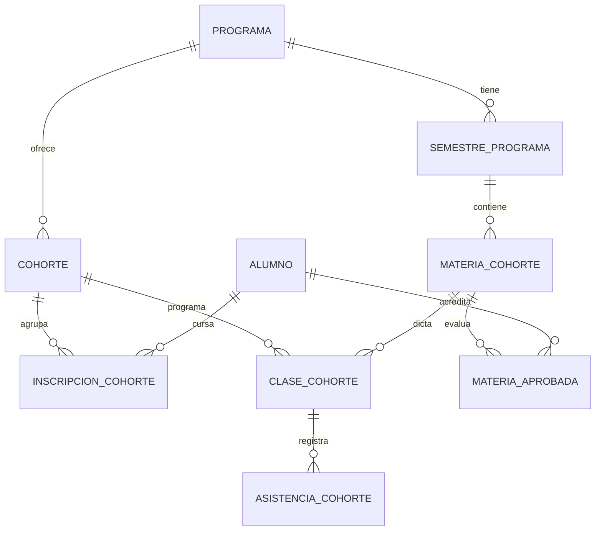

# Módulo: Cohortes académicas

Formación **grupal por cohorte/semestre** para programas como diplomados, técnicos y
capacitación en normas de competencia laboral. Es independiente de Programación CEA
(licencia de conducción 1 a 1) y de Jornadas de capacitación (empresas en campo), pero
se inspira en sus patrones (temas con horas, clases, asistencia).

## 1. Concepto

- Un **programa** puede activar el flag `usaCohortes`.
- El programa se divide en **N semestres** (campo `semestres` ya existente, que además
  reparte el cobro). Cada semestre tiene un total de **horas** (sugerido `horas ÷ N`,
  editable por semestre).
- Cada semestre tiene sus **materias/temas**, cada una con horas. La **suma de horas de
  las materias de un semestre debe ser exacta** a las horas del semestre.
- Una **cohorte** es la oferta de **un semestre del programa en un periodo** (año + nº de
  periodo), con sede, cupo, fechas e instructor.
- El **alumno se matricula a una cohorte por vez** (un semestre). Avanza semestre a
  semestre re-matriculándose. Puede pausar y retomar.
- Las **clases** se programan **por cohorte** (una vez para todo el grupo), una o varias
  sesiones por materia. Cada clase puede tener un **enlace Meet**.
- La **asistencia** la registra el instructor; entrar al Meet desde el portal puede marcar
  asistencia automática. Cada asistencia **consume horas** de la materia.
- Las **materias aprobadas se conservan**: al retomar un semestre, el alumno solo cursa lo
  que le falta.
- **Semestres secuenciales**: para matricular el semestre N el alumno debe haber aprobado
  el N-1.
- El **certificado** es configurable por programa/cohorte.
- En el **Aula Virtual**, aunque el alumno sea presencial, ve su calendario, enlaces Meet,
  asistencia y avance por materia.

## 2. Reglas confirmadas

| Tema | Decisión |
|------|----------|
| Alcance | Por programa: flag `usaCohortes` |
| Cohorte | Código automático + nombre editable |
| Matrícula al grupo | Auto si hay una sola cohorte abierta; manual si hay varias |
| Semestre de cobro | 1 cohorte = 1 semestre de cobro del programa |
| Avance | Secuencial (semestre N exige N-1 aprobado) |
| Retomar | Conserva materias aprobadas; solo cursa las pendientes |
| Horas por semestre | Sugerido `total ÷ N`, editable por semestre |
| Horas de materias | Suma exacta de las horas del semestre (validar al guardar) |
| Sesiones | Varias clases por materia |
| Consumo de horas | Configurable por programa: al asistir / al dictarse |
| Asistencia | Instructor; Meet desde portal marca asistencia automática |
| Evaluaciones | Completas, por fases (v1 nota por materia; v2 banco de preguntas) |
| Certificado | Configurable por programa/cohorte |

## 3. Modelo de datos (MongoDB)

### Colecciones

- `semestresPrograma` — `idProg`, `numSemestre`, `horas`, `orden`.
- `materiasCohorte` — `idProg`, `numSemestre`, `nombre`, `horas`, `orden`, `activo`.
- `cohortes` — `idProg`, `numSemestre`, `anio`, `periodo`, `codigo`, `nombre`, `idSede`,
  `cupoMaximo`, `inscritos`, `estado`, `fechaInicio`, `fechaFin`, `modoConsumoHoras`,
  `certificadoModo`, `idEmpleadoInstructor`.
- `inscripcionesCohorte` — `numDoc`, `idCohorte`, `idProg`, `numSemestre`, `idMatricula`,
  `estado`, `fechaInscripcion`.
- `clasesCohorte` — `idCohorte`, `idMateria`, `idProg`, `fechaClase`, `horaDesde`,
  `horaHasta`, `duracionHoras`, `urlMeet`, `idEmpleadoInstructor`, `estado`, `sesion`,
  `observaciones`.
- `asistenciasCohorte` — `idClase`, `idCohorte`, `numDoc`, `estado`, `origen`,
  `horasConsumidas`, `nota`, `fechaRegistro`.
- `materiasAprobadasCohorte` — `numDoc`, `idMateria`, `idProg`, `numSemestre`, `nota`,
  `aprobada`, `fecha`.

## 4. API (`/api/cohortes-academicas`, auth staff)

| Método | Ruta | Descripción |
|--------|------|-------------|
| GET | `/programas` | Programas con `usaCohortes` |
| GET | `/programas/:idProg/plan` | Semestres + materias del programa |
| PUT | `/programas/:idProg/plan` | Guardar semestres/materias (valida horas) |
| GET | `/cohortes` | Listar cohortes (filtros) |
| POST | `/cohortes` | Crear cohorte |
| PUT | `/cohortes/:id` | Editar cohorte |
| GET | `/cohortes/:id` | Detalle cohorte + inscritos + clases |
| POST | `/cohortes/:id/inscribir` | Inscribir alumno (valida secuencial) |
| GET | `/cohortes/:id/clases` | Clases de la cohorte |
| POST | `/cohortes/:id/clases` | Programar clase(s) |
| POST | `/cohortes/:id/planificar` | Asistente: generar clases por materias |
| PUT | `/clases/:id` | Editar clase (Meet, horario, instructor) |
| GET | `/clases/:id/asistencia` | Lista de asistencia de la clase |
| POST | `/clases/:id/asistencia` | Registrar asistencia (consume horas) |

## 5. API portal (`/api/aula-virtual`, auth alumno)

| Método | Ruta | Descripción |
|--------|------|-------------|
| GET | `/mis-clases-presenciales` | Cohortes del alumno + avance por materia |
| GET | `/mis-clases-presenciales/:idCohorte/calendario` | Clases del grupo + asistencia propia |
| POST | `/clases-cohorte/:idClase/asistir-meet` | Marca asistencia al entrar al Meet |

## 6. Permisos

- `cohortes_academicas.ver`
- `cohortes_academicas.gestionar` (plan, cohortes, programar clases)
- `cohortes_academicas.operar` (asistencia, instructor)

## 7. Fases

- **Fase 1 (entregada):** plan (semestres/materias + validación horas), cohortes,
  inscripción secuencial, programador de clases (manual + asistente), asistencia con
  consumo de horas, portal alumno (calendario, Meet, asistencia, avance por materia),
  clases asociadas a instructores.
- **Fase 2 (entregada):** evaluaciones con banco de preguntas, certificado automático por
  criterios, materiales por materia, actas y reportes.

### Fase 2 — detalle de lo implementado

**Modelos nuevos:** `bancoPreguntasCohorte`, `evaluacionesCohorte`,
`intentosEvaluacionCohorte`, `materialesCohorte`. `cohortes` gana `criteriosCertificado`
(`minAsistenciaPct`, `minNotaPromedio`, `requiereTodasMaterias`, `requiereEvaluaciones`).

**Banco de preguntas:** por programa/semestre/materia, tipos UNICA / MULTIPLE / VF, con
dificultad. Reutilizable en varias evaluaciones.

**Evaluaciones:** por cohorte y materia, dos modos de armado: selección manual de
preguntas del banco o aleatorias (N del banco, materializadas al publicar). Estados
BORRADOR → PUBLICADA → CERRADA, nota de aprobación, peso en la materia, intentos,
ventana de fechas. Calificación automática; la nota realimenta la aprobación de la
materia (promedio ponderado con la nota de asistencia/instructor).

**Materiales:** enlaces, videos o documentos por materia, opcionalmente específicos de
una cohorte; visibles para el alumno en el portal.

**Certificado por criterios + reportes:** elegibilidad por alumno (asistencia %, nota,
materias aprobadas, evaluaciones pendientes) con motivos; acción «finalizar aptos»; acta
de notas (alumno × materia) y reporte de asistencia (alumno × clase).

**Portal alumno:** lista de evaluaciones con su estado/mejor nota, presentación con
corrección y resultado, y materiales de apoyo, dentro de «Mis clases presenciales».

### API añadida (Fase 2)

ERP (`/api/cohortes-academicas`):

| Método | Ruta | Descripción |
|--------|------|-------------|
| GET/POST | `/banco-preguntas` | Listar / crear preguntas |
| PUT/DELETE | `/banco-preguntas/:id` | Editar / eliminar pregunta |
| GET/POST | `/cohortes/:id/evaluaciones` | Listar / crear evaluaciones |
| GET/PUT/DELETE | `/evaluaciones/:idEval` | Detalle / editar / eliminar |
| POST | `/evaluaciones/:idEval/publicar` · `/cerrar` | Publicar / cerrar |
| GET | `/evaluaciones/:idEval/resultados` | Resultados por alumno |
| GET/POST | `/materiales` | Listar / crear material |
| PUT/DELETE | `/materiales/:id` | Editar / eliminar |
| GET | `/cohortes/:id/certificado-elegibilidad` | Elegibilidad por criterios |
| POST | `/cohortes/:id/certificado-finalizar` | Finaliza inscripciones de aptos |
| GET | `/cohortes/:id/acta-notas` · `/reporte-asistencia` | Actas y reportes |

Portal (`/api/aula-virtual`, auth alumno):

| Método | Ruta | Descripción |
|--------|------|-------------|
| GET | `/mis-clases-presenciales/:idCohorte/evaluaciones` | Evaluaciones + mi estado |
| GET | `/mis-clases-presenciales/:idCohorte/materiales` | Materiales de apoyo |
| POST | `/evaluaciones-cohorte/:idEval/iniciar` | Inicia/retoma intento |
| POST | `/evaluaciones-cohorte/:idEval/enviar` | Envía y califica |
