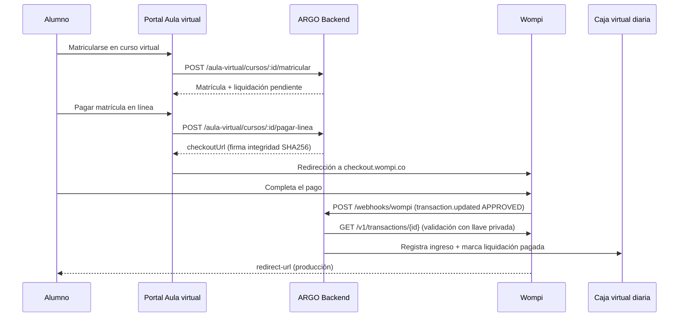

# Guía: pasarela de pagos Wompi (matrículas virtuales)

Integración de **Wompi** en ARGO para cobrar **matrículas virtuales** (tarifa 4) desde el portal **Aula virtual**. Los ingresos se registran en una **caja virtual diaria** (canal 24/7, fuera del cierre general del mostrador).

---

## Resumen

| Tema | Decisión |
|------|----------|
| Pasarela | [Wompi](https://docs.wompi.co/docs/colombia/widget-checkout-web/) |
| Tipo de pago en catálogo | **Pago en línea (PL)** — id `7` |
| Qué se puede pagar en línea | Solo **matrículas virtuales** con saldo pendiente |
| Monto | Siempre **pago total** (no abonos parciales) |
| Caja | **Virtual diaria** global por fecha calendario |
| Cierre general de caja | **No incluye** sesiones virtuales |
| Anulación de comprobante pasarela | Solo **administrador** |
| Caja física (CEA) | También puede cobrar la misma matrícula virtual (pago total) |

---

## Flujo de pago



---

## Pantallas en ARGO (ERP)

| Ruta | Descripción |
|------|-------------|
| `/app/configuracion/pasarela` | Configuración Wompi (llaves, secretos, sede, cuenta) |
| `/app/informes/matriculas-virtuales` | Informes y export CSV de matrículas e ingresos en línea |
| Alumno → **Pagos** | Matrícula virtual: monto de solo lectura, pago total obligatorio |

**Permisos:** `config.recibos`, `aula_virtual.gestionar` o `config.facturacion` (config); `informes.ver`, `aula_virtual.gestionar` o `alumnos.ver` (informes).

---

## Requisitos previos

1. Cuenta de comercio en [Wompi](https://comercios.wompi.co/).
2. En ARGO:
   - Al menos un **programa virtual** publicado en Aula virtual con precio > 0.
   - **Sede** configurada como sede virtual (ej. `PRINCIPAL` o una sede dedicada).
   - **Cuenta bancaria** en catálogo (ID que usará la pasarela como destino).
3. Catálogo **Tipo de pago «Pago en línea (PL)»** — se crea/asegura al guardar la config pasarela o con `seedCatalogosBase.js`.

---

## Configuración en ARGO

Menú: **Configuración → Pasarela Wompi** (`/app/configuracion/pasarela`).

### 1. Seguimiento de transacciones (webhook)

Copie la **URL de eventos** que muestra ARGO y péguela en el panel Wompi.

| Ambiente | URL de eventos (ejemplo) |
|----------|---------------------------|
| Producción (portal) | `https://finstruvial.edu.co/api/webhooks/wompi` |
| Producción (ERP / móvil) | `https://app.finstruvial.edu.co/api/webhooks/wompi` |
| Local + ngrok | `https://TU-SUBDOMINIO.ngrok-free.app/api/webhooks/wompi` |

Use **una URL distinta** para sandbox y para producción en el panel Wompi.

> Wompi **no puede** llamar a `localhost`. En desarrollo local necesita **ngrok** (u otro túnel HTTPS) apuntando al puerto **3000** del backend.

### 2. Llaves del API (panel Wompi → Desarrollo → Programadores)

| Campo ARGO | Campo Wompi | Prefijo sandbox | Prefijo producción |
|------------|-------------|-----------------|---------------------|
| Llave pública | Llave pública | `pub_test_` | `pub_prod_` |
| Llave privada | Llave privada | `prv_test_` | `prv_prod_` |

La llave privada valida cada transacción contra el API de Wompi al recibir el webhook.

### 3. Secretos para integración técnica

| Campo ARGO | Campo Wompi | Uso |
|------------|-------------|-----|
| Eventos | Secreto **Eventos** | Firma del webhook (`signature.properties` + `timestamp`) |
| Integridad | Secreto **Integridad** | Firma del checkout (`reference` + monto centavos + `COP` + secreto → SHA256) |

### 4. Configuración ARGO

| Campo | Descripción |
|-------|-------------|
| Pasarela activa | Habilita pagos en línea en el portal |
| Ambiente | Se infiere de la llave pública (`pub_test_` / `pub_prod_`) |
| ID sede virtual | Sede de la caja virtual diaria |
| ID cuenta bancaria destino | Cuenta que recibe los cobros de pasarela |
| URL retorno portal | Opcional; en producción ej. `https://finstruvial.edu.co/cursos/{id}` |

Pulse **Guardar**.

---

## Configuración en el panel Wompi

1. **Desarrollo → Programadores**
2. **Modo de pruebas:** activo para sandbox, desactivado para dinero real.
3. **URL de Eventos:** pegar la URL del webhook (ver tabla arriba).
4. Copiar llaves y secretos a ARGO.

Documentación oficial:

- [Widget y Checkout Web](https://docs.wompi.co/docs/colombia/widget-checkout-web/)
- [Eventos (webhook)](https://docs.wompi.co/docs/colombia/eventos/)
- [Datos de prueba sandbox](https://docs.wompi.co/docs/colombia/datos-de-prueba-en-sandbox/)

---

## Portal Aula virtual (alumno)

1. Registro / inicio de sesión en el portal.
2. Entrar al curso virtual → **Matricularse** (crea matrícula tarifa 4 + liquidación).
3. Si la pasarela está activa y hay saldo pendiente → **Pagar matrícula en línea**.
4. Checkout Wompi → completar pago.
5. Tras el webhook, la liquidación queda pagada y el acceso/certificado sigue las reglas del curso.

**API portal:** `POST /api/aula-virtual/cursos/:id/pagar-linea` (requiere sesión portal).

---

## Pruebas en local (Windows)

### Servicios

```powershell
# Terminal 1 — Backend :3000
cd c:\proyectos-js\ARGO\argo-backend
pnpm run dev

# Terminal 2 — ERP :4200
cd c:\proyectos-js\ARGO\argo-frontend
pnpm start

# Terminal 3 — Portal :4202
cd c:\proyectos-js\ARGO\argo-aula-virtual
pnpm start
```

### Webhook con ngrok

```powershell
ngrok http 3000
```

En Wompi (sandbox), URL de eventos:

```
https://xxxx.ngrok-free.app/api/webhooks/wompi
```

### Tarjetas de prueba (sandbox)

| Resultado | Número | Notas |
|-----------|--------|--------|
| Aprobada | `4242 4242 4242 4242` | Fecha futura, CVC 3 dígitos |
| Rechazada | `4111 1111 1111 1111` | Para probar declinación |

### Comportamiento en local

- ARGO **omite** `redirect-url` si apunta a `localhost` (Wompi responde **403 CloudFront** si se envía).
- Tras pagar, vuelva manualmente a `http://localhost:4202` y recargue el curso.
- El ingreso en ARGO depende del **webhook** (ngrok activo).

---

## Producción (tras deploy)

En el servidor:

```bash
cd /opt/argo
git pull origin main
docker compose build argo-aula-virtual argo-backend argo-frontend
docker compose up -d --force-recreate argo-aula-virtual argo-backend argo-frontend
```

Luego:

1. Configurar pasarela en ERP con llaves de **producción** (cuando deje sandbox).
2. Webhook en Wompi: `https://finstruvial.edu.co/api/webhooks/wompi`
3. Desactivar **Modo de pruebas** en Wompi.
4. Probar un pago real de bajo monto.

Ver también: [GUIA-GIT-DESPLIEGUE.md](./GUIA-GIT-DESPLIEGUE.md).

---

## API de referencia (backend)

| Método | Ruta | Auth | Descripción |
|--------|------|------|-------------|
| `GET` | `/api/pasarela/config` | Staff | Obtener configuración |
| `PUT` | `/api/pasarela/config` | Staff | Guardar configuración |
| `GET` | `/api/pasarela/config/publico` | Público | `{ activo, ambiente, publicKey }` |
| `POST` | `/api/webhooks/wompi` | Wompi | Evento `transaction.updated` |
| `POST` | `/api/aula-virtual/cursos/:id/pagar-linea` | Portal | Inicia checkout |
| `GET` | `/api/pasarela/informes/matriculas` | Staff | Informe matrículas |
| `GET` | `/api/pasarela/informes/ingresos` | Staff | Informe ingresos en línea |
| `GET` | `/api/pasarela/informes/matriculas/export` | Staff | CSV matrículas |
| `GET` | `/api/pasarela/informes/ingresos/export` | Staff | CSV ingresos |

Clave de configuración en MongoDB: `pasarela_wompi` (colección `Config`).

---

## Seguridad del webhook

1. **Firma de evento:** concatena valores de `signature.properties`, `timestamp` y secreto de eventos → SHA256. Debe coincidir con `X-Event-Checksum` o `signature.checksum`.
2. **Verificación API:** con la llave privada, `GET /v1/transactions/{id}` y validación de referencia, monto y estado `APPROVED`.
3. **Idempotencia:** si el intento ya está aprobado, no duplica ingreso.

---

## Problemas frecuentes

### 403 CloudFront al abrir checkout Wompi

**Causa:** URL de checkout con `redirect-url=http://localhost:...`  
**Solución:** ARGO ya omite redirect local; reinicie backend. En producción use HTTPS público.

### Pago aprobado en Wompi pero no en ARGO

- Webhook mal configurado o ngrok caído.
- Secreto de **Eventos** incorrecto (401 en logs del backend).
- Llave privada faltante o incorrecta.
- Sede virtual o cuenta bancaria no configuradas.

Revise logs:

```bash
docker compose logs argo-backend --tail 100 | grep -i wompi
```

### No aparece «Pagar matrícula en línea»

- Pasarela inactiva o config incompleta en ERP.
- Curso no es virtual / sin liquidación pendiente.
- Alumno no matriculado.

### Switch «Pasarela activa» no respondía

Corregido: el componente usa `[checked]` / `(checkedChange)`, no `ngModel`.

---

## Archivos principales del código

```
argo-backend/
  src/constants/pasarela.js
  src/services/configPasarela.js
  src/services/pasarelaWompi.js
  src/services/wompiWebhook.js
  src/services/wompiApi.js
  src/services/cajaVirtualDiaria.js
  src/services/pagoVirtual.js
  src/models/PagoEnLineaIntent.js
  src/routes/pasarela.js
  src/routes/webhooks.js

argo-frontend/
  src/app/features/config/config-pasarela.component.*
  src/app/features/informes/informes-virtuales.component.*
  src/app/core/services/pasarela.service.ts

argo-aula-virtual/
  src/app/pages/curso-detalle/
  src/app/core/aula-api.service.ts
```

---

## Checklist rápido

- [ ] Llaves Wompi (sandbox o prod) en ARGO
- [ ] Secretos Eventos e Integridad
- [ ] Sede virtual + cuenta bancaria
- [ ] Pasarela **activa** y **Guardar**
- [ ] URL de eventos en panel Wompi (HTTPS público)
- [ ] Modo pruebas coherente con llaves
- [ ] Pago de prueba → ingreso en informes / liquidación pagada

---

*Última actualización: junio 2026 — ARGO + Wompi, matrículas virtuales.*
